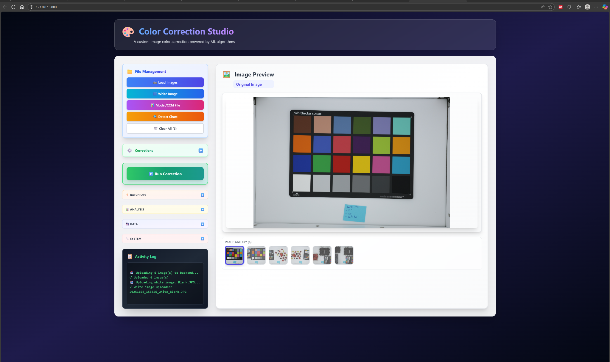

# Color Correction Package UI

A modern web-based user interface for the [ColorCorrectionPackage](https://github.com/collinswakholi/ColorCorrectionPackage).

## Overview

This application provides an intuitive React frontend paired with a Flask backend to perform color correction on images using the ColorCorrectionPackage pipeline. Upload images, detect color charts, run color correction, and visualize results—all from your browser.

## Screenshot


*Upload images, detect color charts, and visualize correction results in real-time*

## Download Pre-built Executables

Get the latest release for your operating system - no installation required!

### Latest Release

Visit the [Releases page](https://github.com/collinswakholi/ColorCorrectionPackage_UI/releases/latest) to download:

- **Windows**: Download `ColorCorrector-Windows.zip`
  - Extract the zip file
  - Run `ColorCorrector.exe`
  - Open your browser to `http://localhost:5000`

- **macOS**: Download `ColorCorrector-macOS.zip`
  - Extract the zip file
  - Run `ColorCorrector` from the terminal or Finder
  - Open your browser to `http://localhost:5000`
  - *Note: You may need to allow the app in System Preferences → Security & Privacy*

- **Linux**: Download `ColorCorrector-Linux.zip`
  - Extract the zip file
  - Make executable: `chmod +x ColorCorrector`
  - Run `./ColorCorrector`
  - Open your browser to `http://localhost:5000`

All executables are self-contained and include the web interface - just download, extract, and run!

## Features

- **Eash image upload** with batch processing support
- **Automatic color chart detection** using the ColorCorrectionPipeline
- **One-click color correction** with visual before/after comparison
- **Interactive scatter plots** showing correction quality
- **Downloadable results** (corrected images and CSV reports)
- **Cross-platform packaging** (Windows EXE, macOS, Linux, Docker)

## Quick Start

### Docker (Recommended)

```bash
docker pull collinswakholi/colorcorrector:latest
docker run -p 5000:5000 collinswakholi/colorcorrector:latest
```

Open [http://localhost:5000](http://localhost:5000) in your browser.

### Local Development

**Prerequisites:** Python 3.12+, Node.js 18+

1. **Backend:**
   ```bash
   cd backend
   pip install -r requirements.txt
   python server_enhanced.py
   ```

2. **Frontend:**
   ```bash
   cd frontend
   npm install
   npm run dev
   ```

Visit [http://localhost:5173](http://localhost:5173) (Vite dev) or [http://localhost:5000](http://localhost:5000) (Flask serves built frontend).

## Building

### Standalone Executable

```bash
cd frontend && npm run build
cd ../backend
pyinstaller -y colorcorrector.spec
```

The executable will be in `backend/dist/ColorCorrector/`.

### Docker Image

```bash
docker build -t colorcorrector -f backend/Dockerfile .
```

## Architecture

- **Frontend:** React + Vite + Tailwind CSS
- **Backend:** Flask REST API wrapping the ColorCorrectionPipeline
- **Core Library:** [ColorCorrectionPackage](https://github.com/collinswakholi/ColorCorrectionPackage)

## License

See [LICENSE.txt](LICENSE.txt)

## Credits

This UI implementation wraps the [ColorCorrectionPackage](https://github.com/collinswakholi/ColorCorrectionPackage) by Collins Wakholi.
