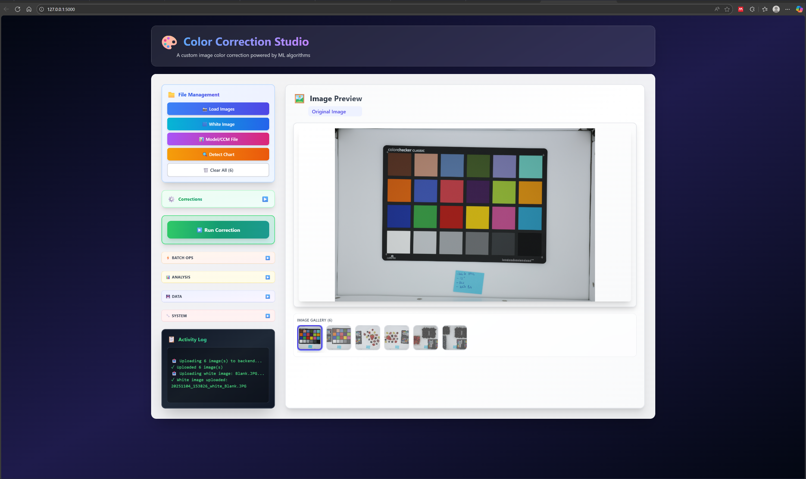

# Color Correction Studio

[](https://github.com/collinswakholi/ColorCorrectionPackage_UI/releases/latest)
[](https://hub.docker.com/r/collins137/colorcorrector)
[](LICENSE.txt)

A modern web-based interface for the [ColorCorrectionPipeline](https://github.com/collinswakholi/ColorCorrectionPackage) — upload images, detect color charts, run stepwise color correction, and visualize results in real-time.



## Download

Get the latest pre-built installer for your OS from the [Releases page](https://github.com/collinswakholi/ColorCorrectionPackage_UI/releases/latest):

| Platform | File | Notes |
|----------|------|-------|
| **Windows x64** | `ColorCorrector-Setup-Windows-x64.exe` | Installer wizard with Start Menu shortcut |
| **macOS Intel** | `ColorCorrector-macOS-x86_64.dmg` | Drag to Applications |
| **macOS Apple Silicon** | `ColorCorrector-macOS-arm64.dmg` | Native M1/M2/M3 build |
| **Linux x64** | `ColorCorrector-Linux-x86_64.AppImage` | `chmod +x` and run directly |
| **Docker** | `collins137/colorcorrector:latest` | `docker pull collins137/colorcorrector:latest` |

All installers are self-contained — no dependencies or manual setup required. The app launches a local server and opens your browser to `http://localhost:5000`.

> **Note:** Unsigned app warnings may appear on first run. Windows: *More info → Run anyway*. macOS: *Right-click → Open*.

## Features

### Pipeline Steps
- **Flat-Field Correction (FFC)** — configurable bin count, white image, sampling method
- **Gamma Correction (GC)** — adjustable gamma value
- **White Balance (WB)** — automatic illuminant-based correction
- **Color Correction (CC)** — multiple methods (linear, polynomial, PLS, neural network) with configurable hidden layers, polynomial degree, and model persistence

### Image Processing
- **Drag-and-drop upload** with multi-image batch support
- **Automatic color chart detection** with confidence scoring and patch visualization
- **Batch processing** — run the full pipeline on selected images with progress tracking
- **Apply trained model** — use a trained CC model to correct new images in parallel

### Analysis & Visualization
- **Before/After comparison** — side-by-side corrected image overlay
- **ΔE (Delta-E) metrics** — per-step color accuracy with configurable thresholds
- **Difference images** — pixel-level deviation heatmaps
- **Scatter plots** — Lab color-space correction quality

### Model Management
- **Save/load trained models** (.pkl) for reuse across sessions
- **Load CCM files** for external model application
- **Configurable save directory** and step-selective export

### UI
- **Modern glassmorphism design** — Indigo + Slate palette, Inter font, Lucide icons
- **Responsive layout** — collapsible panels, sticky header, mobile-friendly
- **Real-time log console** — buffered output with 50KB cap
- **Step-selective save** — choose which pipeline steps and images to export

## Quick Start

### Docker (Recommended)

```bash
docker pull collins137/colorcorrector:latest
docker run -p 5000:5000 collins137/colorcorrector:latest
```

Open [http://localhost:5000](http://localhost:5000).

### Local Development

**Prerequisites:** Python 3.12+, Node.js 18+

```bash
# Backend
cd backend
pip install -r requirements.txt
python server_enhanced.py

# Frontend (separate terminal)
cd frontend
npm install
npm run dev
```

- Vite dev server: [http://localhost:5173](http://localhost:5173)
- Flask (serves built frontend): [http://localhost:5000](http://localhost:5000)

## Building

### Standalone Executable

```bash
cd frontend && npm run build
cd ../backend
pyinstaller -y colorcorrector.spec
```

Output: `backend/dist/ColorCorrector/`

### Docker Image

```bash
docker build -t colorcorrector -f backend/Dockerfile .
docker run -p 5000:5000 colorcorrector
```

## Architecture

| Layer | Stack | Details |
|-------|-------|---------|
| **Frontend** | React 18 + Vite 6 + Tailwind CSS 3 | Modular component design with lazy-loaded modals |
| **Backend** | Flask 2.x REST API | Thread-safe processing, parallel batch inference, lazy analysis endpoints |
| **Core** | [ColorCorrectionPipeline](https://pypi.org/project/ColorCorrectionPipeline/) ≥1.4.3 | Numba/CUDA acceleration, 3D LUT prediction, batch APIs |
| **Packaging** | PyInstaller + Inno Setup / DMG / AppImage | Cross-platform CI via GitHub Actions |

## Dependencies

Core backend requirements (see [requirements.txt](backend/requirements.txt)):

- `ColorCorrectionPipeline>=1.4.3` — the underlying correction engine
- `Flask>=2.3.0`, `flask-cors`, `flask-compress` — web server
- `numba>=0.55.0` — JIT/CUDA acceleration
- `opencv-contrib-python>=4.8.0` — image I/O and chart detection
- `numpy`, `pandas`, `scikit-learn`, `scipy`, `matplotlib`, `Pillow` — scientific stack

## License

This project is licensed under the MIT License — see [LICENSE.txt](LICENSE.txt).

## Credits

Built on [ColorCorrectionPackage](https://github.com/collinswakholi/ColorCorrectionPackage) by [Collins Wakholi](https://github.com/collinswakholi).

Made with ❤️ for the scientific imaging community.
